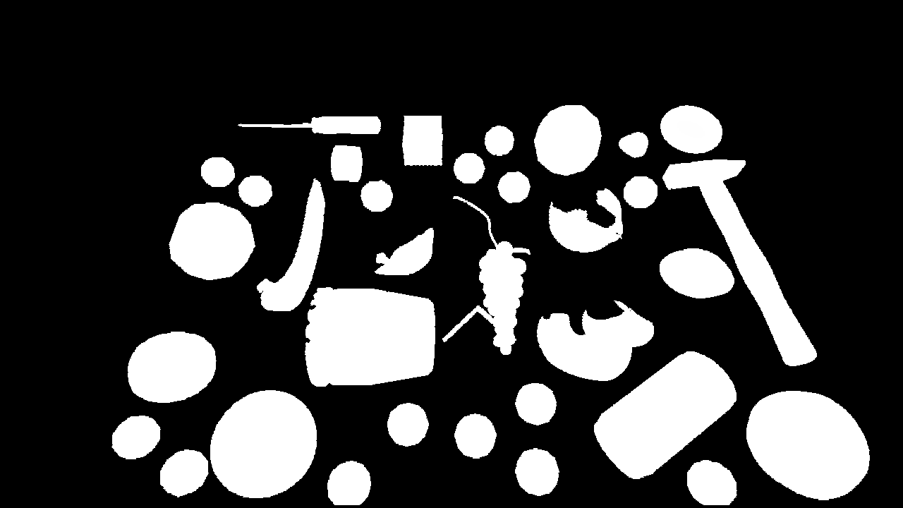
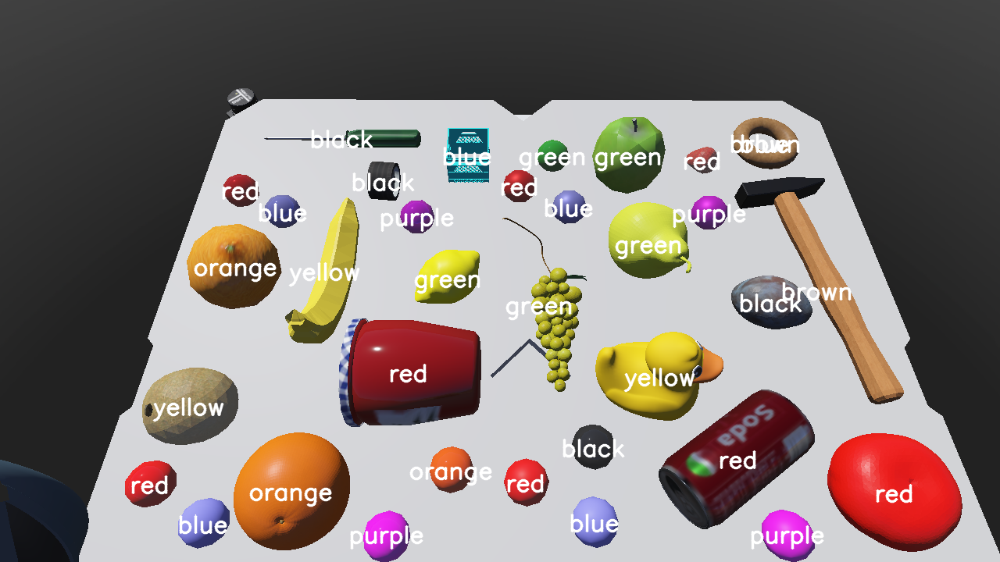

# Color-classifier

Implementation of an object color classifier using machine learning and a small custom dataset. This was developed for the Little Helper 7+ at Aalborg University, however it can also be run as a stand-alone application.

This was developed using [classifiers which support online learning in `scikit-learn`](https://scikit-learn.org/0.15/modules/scaling_strategies.html#incremental-learning). For feature description, histograms in different colour spaces are compared.

 

## Requirements

```bash
pip3 install -r requirements --user
```

The utils package here is also required:[https://bitbucket.org/lh7nlp/lh7-nlp/src/dev/vision_RGB/src/utils/](https://bitbucket.org/lh7nlp/lh7-nlp/src/dev/vision_RGB/src/utils/)

## Project structure

```bash
├── classifier.py      # main file, for classifying objects
├── classifierutils.py # for loading classifier parameters and models, loading/saving the dataset
├── dataset_img        # contains the images used to train the original model
├── dataset_json       # dataset for different colour spaces and histogram resolutions
├── dataset_plots      # images generated for documentation
├── dataset.py         # for generating a JSON dataset file from the training images
├── dataset_user       # images gathered through incremental learning
├── eval.py            # for comparing the performance of different classifiers and parameters
├── requirements.txt
├── test               # images used and generated during testing
└── test.py            # for testing incremental learning
```
